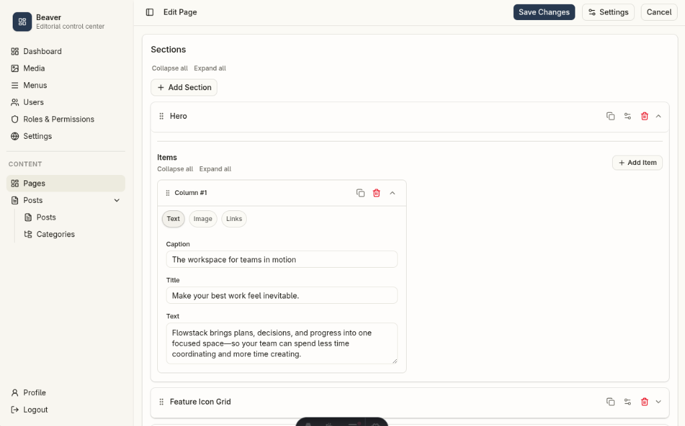

# @zbeaver/beaver

CMS admin, API, and middleware for Astro SSR projects.

[](https://www.npmjs.com/package/@zbeaver/beaver)
[](./LICENSE)



The published artifact contains `dist/**` only: compiled JavaScript, declarations, and the minimal Astro/CSS/JSON runtime assets. Source TypeScript and tests are not published.

## Install

```bash
npm install @zbeaver/beaver
```

Or use the CLI installer to scaffold a new project:

```bash
npx @zbeaver/beaver install flowstack
```

This installs Astro, `@zbeaver/beaver`, and its required integrations, generates
missing config/example files, migrates the database, and seeds the initial
Super Admin. For a new `.env`, the installer generates a unique local admin
email, a strong random password, and the session/JWT secrets, displays the
admin credentials once, then completes the seed in the same command. Save the
password immediately; existing `.env` files are never changed.

The CMS owns its own React UI, Tailwind plugin, and default registries. A host does not need to create Vite aliases or import the CMS stylesheet.

## Astro configuration

```js
import { defineConfig } from "astro/config"
import node from "@astrojs/node"
import react from "@astrojs/react"
import beaver from "@zbeaver/beaver"

export default defineConfig({
  output: "server",
  adapter: node({ mode: "standalone" }),
  integrations: [react(), beaver()],
})
```

This mounts the admin at `/admin`, API at `/api`, and keeps implementation routes private under `/__cms/*`.

## Optional registries

The defaults provide built-in posts/pages, no page sections, and navbar/footer/sidebar menu groups. Pass JSON files only when the host needs custom content types, section templates, or menu groups:

```js
beaver({
  adminPath: "control-panel",
  contentTypeRegistry: new URL("./src/cms/content-types.json", import.meta.url),
  sectionRegistry: new URL("./src/cms/sections.json", import.meta.url),
  menuGroupRegistry: new URL("./src/cms/menu-groups.json", import.meta.url),
})
```

`adminPath` must be one URL segment. If omitted, it uses `ADMIN_PATH` or `admin`.

## Required environment

```dotenv
DATABASE_URL=./db/sqlite.db
SESSION_SECRET=<generated-on-first-install>
ADMIN_JWT_ACCESS_SECRET=<generated-on-first-install>
ADMIN_JWT_REFRESH_SECRET=<generated-on-first-install>
ADMIN_EMAIL=admin-<random>@cms.local
ADMIN_PASSWORD=cms_<random>
ADMIN_NAME=Administrator
UPLOAD_DIR=./public
# Set this only behind a proxy that overwrites forwarded-IP headers.
TRUST_PROXY=false
# Obtain both values from Cloudflare Turnstile. The site key is safe for client use.
PUBLIC_TURNSTILE_SITE_KEY=
TURNSTILE_SECRET_KEY=
CONTACT_TURNSTILE_REQUIRED=false
```

Media files are stored below `storage/` in `UPLOAD_DIR`, so the default path is
`public/storage/` and URLs are `/storage/<file>`. On
cPanel, set `UPLOAD_DIR` to the domain document root, for example
`/home/CPANEL_USER/public_html`.

`POST /api/contact` is same-origin only, limited to five requests per 15 minutes
per client address, and accepts an optional `turnstileToken`. Set
`CONTACT_TURNSTILE_REQUIRED=true` and `TURNSTILE_SECRET_KEY` in production to
require server-side Turnstile validation. When `TRUST_PROXY=true`, ensure the
proxy overwrites `CF-Connecting-IP` or `X-Forwarded-For`.

The host is responsible for applying the exported Drizzle schema and running the seed module as part of its own deployment workflow.

## CLI commands

The package provides the following CLI commands for consuming projects:

```bash
npx @zbeaver/beaver config                  # Generate .env and astro.config.mjs
npx @zbeaver/beaver example flowstack       # Copy the Flowstack public template and skill
npx @zbeaver/beaver migrate                 # Apply SQLite schema
npx @zbeaver/beaver seed flowstack          # Create base data and import Flowstack demo data
npx @zbeaver/beaver reset superadmin        # Reset super-admin password from .env
npx @zbeaver/beaver install flowstack       # Configure, copy, migrate, and seed Flowstack
```

### `config`

Generates `.env` and `astro.config.mjs` from bundled templates. Skips existing files to avoid overwriting customizations.

### `example [template]`

Copies a template profile into the consuming project. `flowstack` is the bundled profile:
- `src/components/web/` — all web components (sections, templates, navbar, footer)
- `src/pages/` — `index.astro`, `search.astro`, `tag/[tag].astro`, `system/*`, `[type]/*`
- `skills/design-web-components/` — skill definition and references

Existing files are never overwritten.

### `migrate` / `seed [template]`

`migrate` applies the SQLite schema bundled with the package and records it in Drizzle's migration table. Run it before starting the application on each deployment. `seed` creates the default roles, permissions, and administrator from the required environment variables. Adding `flowstack` imports its idempotent content data after the base seed.

### `reset superadmin`

Loads `ADMIN_EMAIL` and `ADMIN_PASSWORD` from the current project's `.env`,
updates the matching `super-admin` user, and revokes that user's active refresh
sessions. The password must be at least 12 characters. It never creates a user;
run `seed` first if the super-admin account does not exist.

## License

[MIT](./LICENSE) © 2026 beaver
